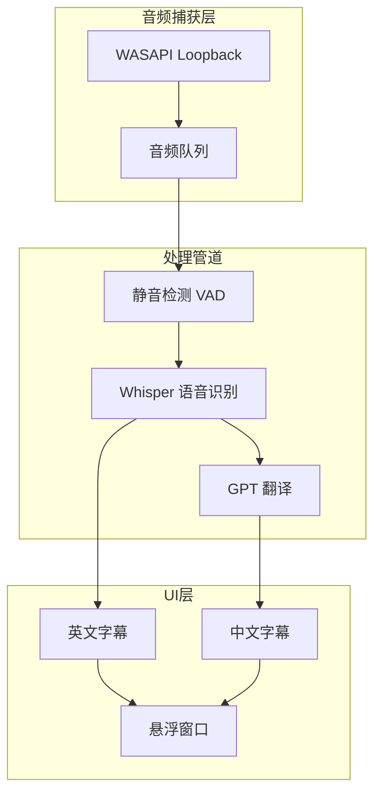

# 🎙️ LiveCaption - 实时双语字幕翻译器

<p align="center">
  
  
  
</p>

**LiveCaption** 是一款 Windows 桌面应用程序，实时捕获系统音频（如视频、会议、直播），使用 Whisper 进行语音识别，并通过 GPT 翻译成中文，以悬浮字幕窗口同步显示双语内容。


## ✨ 功能特点

- 🔊 **系统音频捕获** - 基于 WASAPI Loopback，无需额外虚拟设备
- 🎯 **实时语音识别** - 使用 faster-whisper (GPU 加速)，延迟低至 1-2 秒
- 🌏 **智能翻译** - GPT-4o-mini 驱动，流式输出，自然流畅
- 🖥️ **悬浮字幕** - 无边框置顶窗口，可拖动、半透明背景
- 🧠 **智能分句** - 基于静音检测，避免句子被过早切断

## 🚀 快速开始

### 环境要求

- Windows 10/11
- Python 3.10+
- NVIDIA GPU (推荐, 支持 CUDA 11.x/12.x)
- 8GB+ 显存 (运行 whisper-small 模型)

### 安装

```bash
# 1. 克隆项目
git clone https://github.com/wzyu26/livecaption.git
cd livecaption

# 2. 创建虚拟环境 (推荐使用 conda)
conda create -n livecaption python=3.10
conda activate livecaption

# 3. 安装依赖
pip install -r requirements.txt

# 4. 配置 API Key
cp .env.example .env
# 编辑 .env 文件，填入你的 OpenAI API Key
```

### 配置

编辑 `.env` 文件：

```env
OPENAI_API_KEY=sk-your-api-key-here
OPENAI_BASE_URL=https://api.openai.com/v1
```

> 💡 支持 OpenAI 兼容的 API 服务，如 Azure OpenAI、Anthropic Claude 等

### 运行

```bash
python main.py
```

## 🎮 使用方法

| 操作 | 说明 |
|------|------|
| **拖动** | 按住窗口任意位置拖动 |
| **双击** | 退出程序 |
| **Ctrl+C** | 终端中强制退出 |

## 📁 项目结构

```
livecaption/
├── main.py                 # 程序入口
├── config.py               # 配置管理
├── requirements.txt        # 依赖清单
├── .env.example            # 环境变量模板
│
└── modules/
    ├── audio.py            # 🔊 音频捕获 (WASAPI Loopback)
    ├── asr.py              # 🎯 语音识别 (faster-whisper)
    ├── llm.py              # 🌏 翻译服务 (OpenAI API)
    └── ui.py               # 🖥️ 悬浮字幕窗口 (PyQt6)

```

## ⚙️ 配置参数

编辑 `config.py` 调整参数：

### Whisper 设置

| 参数 | 默认值 | 说明 |
|------|--------|------|
| `WHISPER_MODEL_SIZE` | `small` | 模型大小: tiny/small/medium/large-v3 |
| `DEVICE` | `cuda` | 设备: cuda (GPU) / cpu |
| `COMPUTE_TYPE` | `float16` | 计算精度: float16/int8 |

### 分句参数

| 参数 | 默认值 | 说明 |
|------|--------|------|
| `MIN_SILENCE_DURATION_MS` | `800` | 静音阈值 (毫秒) |
| `VAD_CHUNK_SECONDS` | `2.5` | 基础处理间隔 (秒) |
| `MAX_BUFFER_SECONDS` | `8.0` | 最大缓冲时间 (秒) |

### UI 样式

| 参数 | 默认值 | 说明 |
|------|--------|------|
| `WINDOW_WIDTH` | `1000` | 窗口宽度 |
| `FONT_SIZE_EN` | `16` | 英文字体大小 |
| `FONT_SIZE_CN` | `24` | 中文字体大小 |
| `COLOR_EN` | `#BBBBBB` | 英文字体颜色 |
| `COLOR_CN` | `#FFD700` | 中文字体颜色 (金色) |

## 🔧 常见问题

### Q: 提示 `Invalid device` 错误？
A: 音频设备通道数不匹配，已在最新版本修复。请确保使用最新代码。

### Q: 模型加载很慢/失败？
A: 首次运行需要下载 ~500MB 模型文件。如果下载中断，请删除缓存重试：
```bash
rd /s /q "%USERPROFILE%\.cache\huggingface\hub\models--Systran--faster-whisper-small"
```

### Q: OpenMP Error #15？
A: 请确保通过 `python main.py` 运行，而不是直接运行模块文件。

### Q: 翻译不准确/句子被切断？
A: 调整 `config.py` 中的 `MIN_SILENCE_DURATION_MS` (增大) 和 `VAD_CHUNK_SECONDS` (增大)。

## 🛠️ 技术架构



## 📊 性能指标

| 指标 | 数值 |
|------|------|
| 端到端延迟 | 1.5-2.5 秒 |
| GPU 显存占用 | ~2GB (whisper-small) |
| CPU 占用 | ~10-15% |

## 📄 许可证

GPL v3 License - 详见 [LICENSE](LICENSE)

## 🙏 致谢

- [faster-whisper](https://github.com/SYSTRAN/faster-whisper) - 高效的 Whisper 实现
- [pyaudiowpatch](https://github.com/s0d3s/PyAudioWPatch) - Windows 音频捕获
- [PyQt6](https://www.riverbankcomputing.com/software/pyqt/) - GUI 框架
- [OpenAI](https://openai.com/) - GPT API

---

<p align="center">
  Made with ❤️ for real-time translation
</p>
